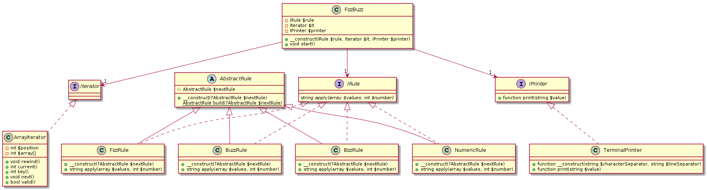

## Overview
- PHP7.1でFizzBuzzを実装
- SOLID原則に準じて実装してみました
- へっぽこエンジニアなのでご指導ご鞭撻いただけると幸いです
- 詳細は https://www.slideshare.net/KiyoshiSuzuki5/fizzbuzz-solid を参照お願いします
## Installation

```
$ git clone git@github.com:SuzukiCecil/FizzBuzz_Solid.git && cd FizzBuzz_Solid
```

## Usage

```
$ php index.php
```

## UML



Written by PlantUML
